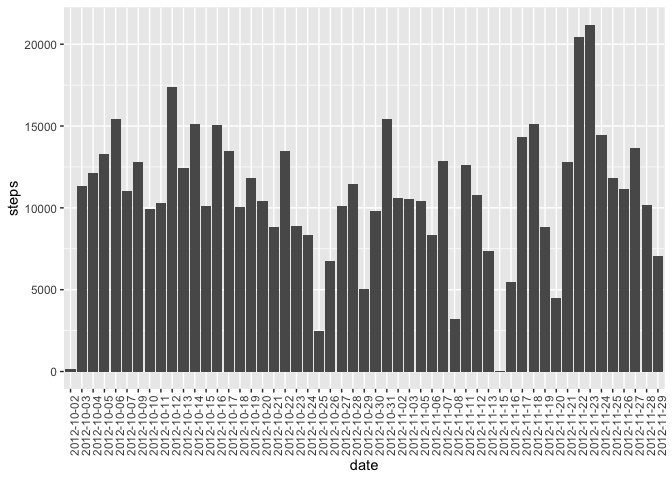
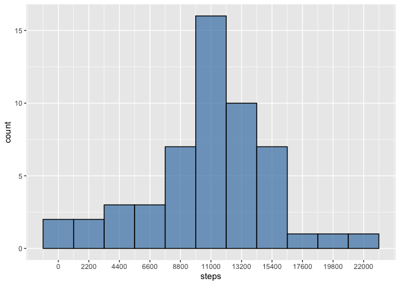
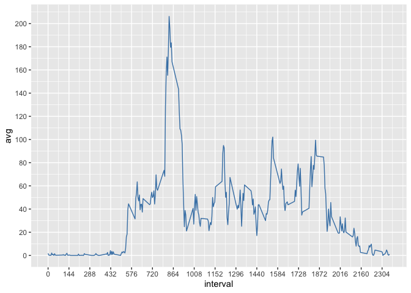
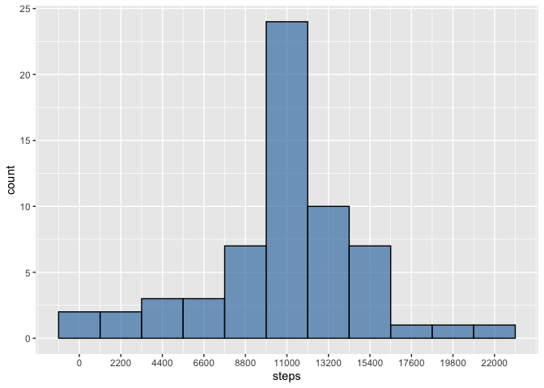
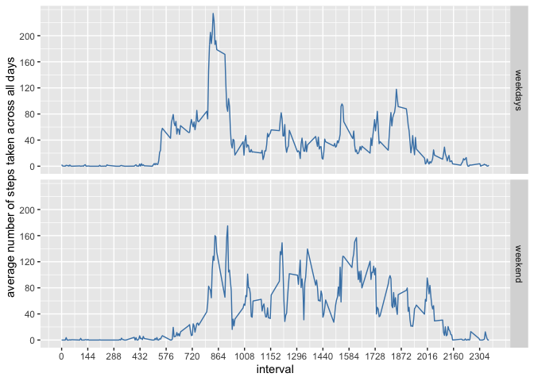

# Introduction

It is now possible to collect a large amount of data about personal
movement using activity monitoring devices such as a
[Fitbit](http://www.fitbit.com/ "Fitbit"), [Nike
Fuelband](http://www.nike.com/us/en_us/c/nikeplus-fuelband/ "Nike Fuelband"),
or [Jawbone Up](https://jawbone.com/up/ "Jawbone Up"). These type of
devices are part of the “quantified self” movement – a group of
enthusiasts who take measurements about themselves regularly to improve
their health, to find patterns in their behavior, or because they are
tech geeks. But these data remain under-utilized both because the raw
data are hard to obtain and there is a lack of statistical methods and
software for processing and interpreting the data.

This assignment makes use of data from a personal activity monitoring
device. This device collects data at 5 minute intervals through out the
day. The data consists of two months of data from an anonymous
individual collected during the months of October and November, 2012 and
include the number of steps taken in 5 minute intervals each day.

The data for this assignment can be downloaded from the course web site:

> Dataset: [Activity monitoring
> data](https://d396qusza40orc.cloudfront.net/repdata%2Fdata%2Factivity.zip/ "Activity monitoring data")

The variables included in this dataset are:

1.  steps: Number of steps taking in a 5-minute interval (missing values
    are coded as NA)  
2.  date: The date on which the measurement was taken in YYYY-MM-DD
    format  
3.  interval: Identifier for the 5-minute interval in which measurement
    was taken

The dataset is stored in a comma-separated-value (CSV) file and there
are a total of 17,568 observations in this dataset.  
 

# Review criteria

 

### Repo

1.  Valid GitHub URL  
2.  At least one commit beyond the original fork  
3.  Valid SHA-1  
4.  SHA-1 corresponds to a specific commit  
     

### Commit containing full submission

1.  Code for reading in the dataset and/or processing the data  
2.  Histogram of the total number of steps taken each day  
3.  Mean and median number of steps taken each day  
4.  Time series plot of the average number of steps taken  
5.  The 5-minute interval that, on average, contains the maximum number
    of steps  
6.  Code to describe and show a strategy for imputing missing data  
7.  Histogram of the total number of steps taken each day after missing
    values are imputed  
8.  Panel plot comparing the average number of steps taken per 5-minute
    interval across weekdays and weekends  
9.  All of the R code needed to reproduce the results (numbers, plots,
    etc.) in the report  
     

# Assignment

This assignment will be described in multiple parts. You will need to
write a report that answers the questions detailed below. Ultimately,
you will need to complete the entire assignment in a **single R
markdown** document that can be processed by **knitr** and be
transformed into an HTML file.

Throughout your report make sure you always include the code that you
used to generate the output you present. When writing code chunks in the
R markdown document, always use `echo = TRUE` so that someone else will
be able to read the code. **This assignment will be evaluated via peer
assessment so it is essential that your peer evaluators be able to
review the code for your analysis.**

For the plotting aspects of this assignment, feel free to use any
plotting system in R (i.e., base, lattice, ggplot2)

Fork/clone the [GitHub repository created for this
assignment](http://github.com/rdpeng/RepData_PeerAssessment1/ "GitHub repository created for this assignment").
You will submit this assignment by pushing your completed files into
your forked repository on GitHub. The assignment submission will consist
of the URL to your GitHub repository and the SHA-1 commit ID for your
repository state.

NOTE: The GitHub repository also contains the dataset for the assignment
so you do not have to download the data separately.  
 

### Loading and preprocessing the data

Show any code that is needed to  
1. Load the data (i.e. `read.csv()`)  
2. Process/transform the data (if necessary) into a format suitable for
your analysis

#### library packages

    library(dplyr)

    ## 
    ## Attaching package: 'dplyr'

    ## The following objects are masked from 'package:stats':
    ## 
    ##     filter, lag

    ## The following objects are masked from 'package:base':
    ## 
    ##     intersect, setdiff, setequal, union

    library(tidyverse)

    ## ── Attaching packages
    ## ───────────────────────────────────────
    ## tidyverse 1.3.2 ──

    ## ✔ ggplot2 3.3.6     ✔ purrr   0.3.4
    ## ✔ tibble  3.1.8     ✔ stringr 1.4.0
    ## ✔ tidyr   1.2.0     ✔ forcats 0.5.1
    ## ✔ readr   2.1.2     
    ## ── Conflicts ────────────────────────────────────────── tidyverse_conflicts() ──
    ## ✖ dplyr::filter() masks stats::filter()
    ## ✖ dplyr::lag()    masks stats::lag()

    library(ggplot2)
    library(tidyr)
    library(magrittr)

    ## 
    ## Attaching package: 'magrittr'
    ## 
    ## The following object is masked from 'package:purrr':
    ## 
    ##     set_names
    ## 
    ## The following object is masked from 'package:tidyr':
    ## 
    ##     extract

    library(lattice)
    library(knitr)

#### download, unzip, and open

    # Create an empty folder  
    if(!file.exists("data")){ 
      dir.create("data")
    }

    # Download the data file
    fileUrl <- "https://d396qusza40orc.cloudfront.net/repdata%2Fdata%2Factivity.zip"
    download.file(fileUrl, destfile = "./data/activity_monitoring.zip", method = "curl")
    zipfile <- "./data/activity_monitoring.zip"
    list.files("./data")

    # Unzip the data file
    if(!file.exists("./data/activity_monitoring")){
      dir.create("./data/activity_monitoring")
    } 
    out_dir <- "./data/activity_monitoring" 
    unzip(zipfile, exdir = out_dir) 
    list.files("./data/activity_monitoring")

    # Open the data file 
    setwd("./data/activity_monitoring")
    am <- read.csv("activity.csv")

    # Quick check
    summary(am)

    ##      steps            date              interval     
    ##  Min.   :  0.00   Length:17568       Min.   :   0.0  
    ##  1st Qu.:  0.00   Class :character   1st Qu.: 588.8  
    ##  Median :  0.00   Mode  :character   Median :1177.5  
    ##  Mean   : 37.38                      Mean   :1177.5  
    ##  3rd Qu.: 12.00                      3rd Qu.:1766.2  
    ##  Max.   :806.00                      Max.   :2355.0  
    ##  NA's   :2304

    head(am, n = 2L)

    ##   steps       date interval
    ## 1    NA 2012-10-01        0
    ## 2    NA 2012-10-01        5

#### process and transform

    # remove NAs 
    am_noNAs <- na.omit(am)
    summary(am_noNAs)

    ##      steps            date              interval     
    ##  Min.   :  0.00   Length:15264       Min.   :   0.0  
    ##  1st Qu.:  0.00   Class :character   1st Qu.: 588.8  
    ##  Median :  0.00   Mode  :character   Median :1177.5  
    ##  Mean   : 37.38                      Mean   :1177.5  
    ##  3rd Qu.: 12.00                      3rd Qu.:1766.2  
    ##  Max.   :806.00                      Max.   :2355.0

 

### What is mean total number of steps taken per day?

For this part of the assignment, you can ignore the missing values in
the dataset.  
1. Calculate the total number of steps taken per day  
2. If you do not understand the difference between a histogram and a
barplot, research the difference between them. Make a histogram of the
total number of steps taken each day  
3. Calculate and report the mean and median of the total number of steps
taken per day

#### Calculate the total number of steps taken per day

    sum_steps <- am_noNAs %>% group_by(date) %>% summarise(sum_steps = sum(steps))
    sum_steps <- as.data.frame(sum_steps)
    colnames(sum_steps) <- c("date", "steps")
    head(sum_steps, n = 2L)

    ##         date steps
    ## 1 2012-10-02   126
    ## 2 2012-10-03 11352

#### Make a histogram of the total number of steps taken each day

What is a histogram? A histogram is a graph that shows the **frequency**
of numerical data using rectangles.

    # The first plot is the total number of steps taken each day plotted against date 
    barplot_1 <-ggplot(data=sum_steps, 
                       aes(x=date, y=steps)) +
      geom_bar(stat="identity") + 
      theme(axis.text.x = element_text(angle = 90))
    barplot_1 

    # The second plot is the histogram of total number of steps taken each day 
    histogram <- ggplot(data = sum_steps, 
                        aes(x = steps)) +
      geom_histogram(binwidth = 22000/10, fill = "#4682B4", color = "black", alpha = 0.7) + 
      scale_x_continuous(breaks = seq(0, 22000, by = 2200))
    histogram 

#### Mean and Median of the total number of steps taken per day

    summary(sum_steps)

    ##      date               steps      
    ##  Length:53          Min.   :   41  
    ##  Class :character   1st Qu.: 8841  
    ##  Mode  :character   Median :10765  
    ##                     Mean   :10766  
    ##                     3rd Qu.:13294  
    ##                     Max.   :21194

answer: the mean equals to 10766 and median equals to 10765  
 

### What is the average daily activity pattern?

1.  Make a time series plot (i.e. `type = "l"`) of the 5-minute interval
    (x-axis) and the average number of steps taken, averaged across all
    days (y-axis)  
2.  Which 5-minute interval, on average across all the days in the
    dataset, contains the maximum number of steps?

#### Make a time series plot

    # Find the average number of steps taken across all days grouped by 5-minute interval
    am_interval <- am_noNAs 
    am_interval$steps <- as.integer(am_interval$steps)
    am_interval <- am_interval %>% group_by(interval) %>% summarise(avg = mean(steps)) 
    head(am_interval, n = 2L)

    ## # A tibble: 2 × 2
    ##   interval   avg
    ##      <int> <dbl>
    ## 1        0 1.72 
    ## 2        5 0.340

    summary(am_interval)

    ##     interval           avg         
    ##  Min.   :   0.0   Min.   :  0.000  
    ##  1st Qu.: 588.8   1st Qu.:  2.486  
    ##  Median :1177.5   Median : 34.113  
    ##  Mean   :1177.5   Mean   : 37.383  
    ##  3rd Qu.:1766.2   3rd Qu.: 52.835  
    ##  Max.   :2355.0   Max.   :206.170

    # Make a time series plot 
    time_series <- ggplot(data = am_interval, 
                          aes(x = interval, y = avg)) +
      geom_line(color = "#4682B4") + 
      scale_x_continuous(breaks = seq(0, max(am_interval$interval), by = 144)) +
      scale_y_continuous(breaks = seq(0, max(am_interval$avg), by = 20))
    time_series

#### Which 5-minute interval contains the maximum number of steps?

    am_interval %>% filter(avg == max(avg)) 

    ## # A tibble: 1 × 2
    ##   interval   avg
    ##      <int> <dbl>
    ## 1      835  206.

answer: the 835 interval contains the maximum number of steps.

 

### Imputing missing values

Note that there are a number of days/intervals where there are missing
values (coded as `NA`). The presence of missing days may introduce bias
into some calculations or summaries of the data.  
1. Calculate and report the total number of missing values in the
dataset (i.e. the total number of rows with `NAs`)  
2. Devise a strategy for filling in all of the missing values in the
dataset. The strategy does not need to be sophisticated. For example,
you could use the mean/median for that day, or the mean for that
5-minute interval, etc.  
3. Create a new dataset that is equal to the original dataset but with
the missing data filled in.  
4. Make a histogram of the total number of steps taken each day and
Calculate and report the **mean** and **median** total number of steps
taken per day. Do these values differ from the estimates from the first
part of the assignment? What is the impact of imputing missing data on
the estimates of the total daily number of steps?

#### Total number of missing values in dataset

    summary(am)

    ##      steps            date              interval     
    ##  Min.   :  0.00   Length:17568       Min.   :   0.0  
    ##  1st Qu.:  0.00   Class :character   1st Qu.: 588.8  
    ##  Median :  0.00   Mode  :character   Median :1177.5  
    ##  Mean   : 37.38                      Mean   :1177.5  
    ##  3rd Qu.: 12.00                      3rd Qu.:1766.2  
    ##  Max.   :806.00                      Max.   :2355.0  
    ##  NA's   :2304

answer: the total number of missing values in data-set is 2304

#### Devise a strategy for filling in all of the missing values in the dataset.

    # Examine what dates have steps = NAs
    am <- as.data.frame(am)
    NA_rows <- am %>% filter(is.na(steps)) %>% group_by(date) %>% summarise(mean = mean(steps))
    NA_rows 

    ## # A tibble: 8 × 2
    ##   date        mean
    ##   <chr>      <dbl>
    ## 1 2012-10-01    NA
    ## 2 2012-10-08    NA
    ## 3 2012-11-01    NA
    ## 4 2012-11-04    NA
    ## 5 2012-11-09    NA
    ## 6 2012-11-10    NA
    ## 7 2012-11-14    NA
    ## 8 2012-11-30    NA

    # The average steps calculated by interval 
    avg_steps_by_int <- as.list(am_interval$avg)

    # Find out the row number and store them in data frame 
    date <- as.list(NA_rows$date)
    row_nums_of_NA_date <- NA
    for (i in date){
      temporary <- as.data.frame(which(am$date == i, arr.ind = TRUE))
      row_nums_of_NA_date <- cbind(row_nums_of_NA_date, temporary)
    }
    row_nums_of_NA_date <- row_nums_of_NA_date[2:9]
    colnames(row_nums_of_NA_date) <- date
    # we only need the first and last number of each column, so...
    head_tail <- row_nums_of_NA_date %>% slice(1, 288) %>% as.data.frame
    # transpose the data frame 
    ht <- as.data.frame(t(head_tail))

#### Create a new dataset that is equal to the original dataset but with the missing data filled in.

    # Replace 
    am_dup <- am #create a duplicate data set 
    for (i in 1:8) {
      am_dup$steps[ht$V1[i]:ht$V2[i]] <- avg_steps_by_int
    }

    # Aftermath 
    am_dup$steps <- as.numeric(am_dup$steps)
    am_dup <- as.data.frame(am_dup)
    summary(am_dup)

    ##      steps            date              interval     
    ##  Min.   :  0.00   Length:17568       Min.   :   0.0  
    ##  1st Qu.:  0.00   Class :character   1st Qu.: 588.8  
    ##  Median :  0.00   Mode  :character   Median :1177.5  
    ##  Mean   : 37.38                      Mean   :1177.5  
    ##  3rd Qu.: 27.00                      3rd Qu.:1766.2  
    ##  Max.   :806.00                      Max.   :2355.0

    head(am_dup, n = 2L)

    ##       steps       date interval
    ## 1 1.7169811 2012-10-01        0
    ## 2 0.3396226 2012-10-01        5

#### Make a histogram of the total number of steps taken each day

    # calculate the total number of steps taken each day 
    sum_steps_1 <- am_dup %>% group_by(date) %>% summarise(sum_steps_1 = sum(steps))
    sum_steps_1 <- as.data.frame(sum_steps_1)
    colnames(sum_steps_1) <- c("date", "steps")
    head(sum_steps_1, n = 2L)

    ##         date    steps
    ## 1 2012-10-01 10766.19
    ## 2 2012-10-02   126.00

    # make a histogram 
    histogram <- ggplot(data = sum_steps_1, 
                        aes(x = steps)) +
      geom_histogram(binwidth = 22000/10, fill = "#4682B4", color = "black", alpha = 0.7) + 
      scale_x_continuous(breaks = seq(0, 22000, by = 2200))
    histogram 

#### Mean and Median? Do they differ from original plot?

    summary(sum_steps_1)

    ##      date               steps      
    ##  Length:61          Min.   :   41  
    ##  Class :character   1st Qu.: 9819  
    ##  Mode  :character   Median :10766  
    ##                     Mean   :10766  
    ##                     3rd Qu.:12811  
    ##                     Max.   :21194

answer: the mean remains the same while median value increased by 1

 

### Are there differences in activity patterns between weekdays and weekends?

For this part the `weekdays()` function may be of some help here. Use
the dataset with the filled-in missing values for this part.  
1. Create a new factor variable in the dataset with two levels –
“weekday” and “weekend” indicating whether a given date is a weekday or
weekend day.

    # Convert the date column into type "Date"
    am$date <- as.Date(am$date)
    # Create new column that stores which weekdays is it for each Date
    am$days <- weekdays(am$date)
    # Create an empty column to store the factor variables 
    am$weekdays <- NA
    # For loop to assign weekend/weekdays to each date 
    for (i in 1:17568){
      if(identical(am$days[i], "Saturday")){
        am$weekdays[i] <- "weekend"
      }
      else if (identical(am$days[i], "Sunday")){
        am$weekdays[i] <- "weekend"
      }
      else{am$weekdays[i] <- "weekdays"}
    }
    # Make the column into factor variable 
    am$weekdays <- as.factor(am$weekdays)
    # Check if it's factor variable, head the table 
    class(am$weekdays)

    ## [1] "factor"

    head(am, n = 2L)

    ##   steps       date interval   days weekdays
    ## 1    NA 2012-10-01        0 Monday weekdays
    ## 2    NA 2012-10-01        5 Monday weekdays

1.  Make a panel plot containing a time series plot (i.e. `type = "l"`)
    of the 5-minute interval (x-axis) and the average number of steps
    taken, averaged across all weekday days or weekend days (y-axis).
    See the README file in the GitHub repository to see an example of
    what this plot should look like using simulated data.

<!-- -->

    # Find the average number of steps taken across all days grouped by 5-minute interval
    am_noNAs <- na.omit(am)
    am_interval_1 <- am_noNAs 
    am_interval_1$steps <- as.integer(am_interval_1$steps)
    am_interval_1 <- am_interval_1 %>% group_by(weekdays, interval)  %>% 
      summarise(avg = mean(steps))

    ## `summarise()` has grouped output by 'weekdays'. You can override using the
    ## `.groups` argument.

    # Make a panel plot 
    time_series_1 <- ggplot(data = am_interval_1, 
                            aes(x = interval, y = avg)) +
      geom_line(color = "#4682B4")+
      facet_grid(weekdays~. ) +
      scale_x_continuous(breaks = seq(0, max(am_interval$interval), by = 144)) +
      scale_y_continuous(breaks = seq(0, max(am_interval$avg), by = 40)) +
      ylab("average number of steps taken across all days")
    time_series_1

 

# Submitting the Assignment

### To submit the assignment:

1.  Commit your completed `PA1_template.Rmd` file to the **master**
    branch of your git repository (you should already be on the
    **master** branch unless you created new ones)  
2.  Commit your `PA1_template.md` and `PA1_template.html` files produced
    by processing your R markdown file with `knit2html()` function in R
    (from the knitr package) by running the function from the console.  
3.  If your document has figures included (it should) then they should
    have been placed in the `figure/ directory` by default (unless you
    overrided the default). Add and commit the `figure/ directory` to
    your git repository so that the figures appear in the markdown file
    when it displays on github.  
4.  Push your **master** branch to GitHub.  
5.  Submit the URL to your GitHub repository for this assignment on the
    course web site.  
     

### In addition to submitting the URL for your GitHub repository, you will need to submit the 40 character SHA-1 hash (as string of numbers from 0-9 and letters from a-f) that identifies the repository commit that contains the version of the files you want to submit. You can do this in GitHub by doing the following

1.  Going to your GitHub repository web page for this assignment  
2.  Click on the “?? commits” link where ?? is the number of commits you
    have in the repository. For example, if you made a total of 10
    commits to this repository, the link should say “10 commits”.  
3.  You will see a list of commits that you have made to this
    repository. The most recent commit is at the very top. If this
    represents the version of the files you want to submit, then just
    click the “copy to clipboard” button on the right hand side that
    should appear when you hover over the SHA-1 hash. Paste this SHA-1
    hash into the course web site when you submit your assignment. If
    you don’t want to use the most recent commit, then go down and find
    the commit you want and copy the SHA-1 hash.  
     

#### A valid submission will look something like (this is just an example!)

    https://github.com/rdpeng/RepData_PeerAssessment17c376cc54
    47f11537f8740af8e07d6facc3d9645
